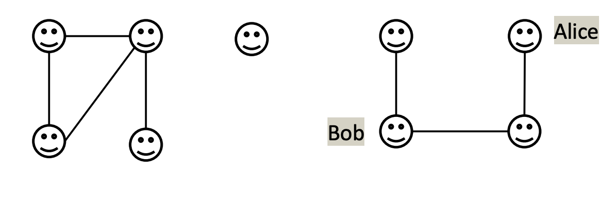
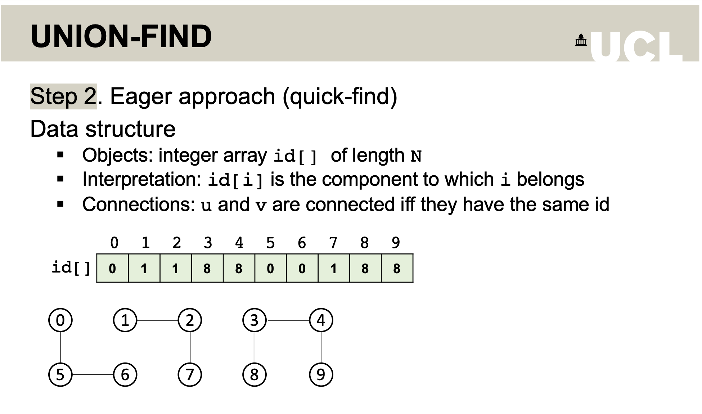
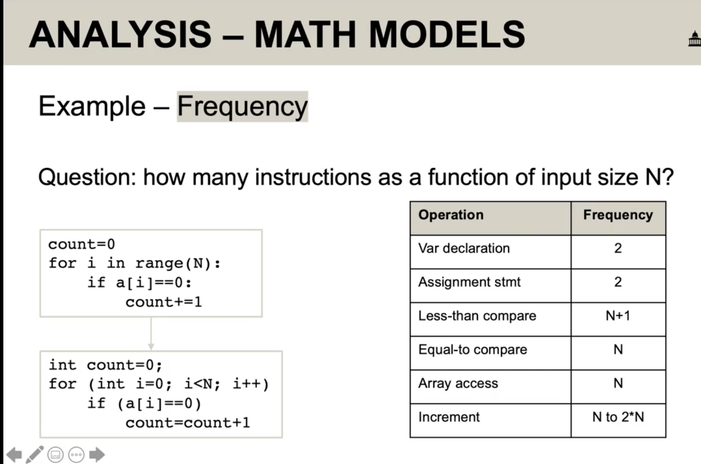

# COMP0005 Note for Week 1 Lecture

Zhouzhou Zhang, Jan 14

## Union Find

Union Find is a problem where N objects are given and we need find a path to connect two objects.

## 1.Model

We can bulid the model like this. Use a sequence of number to stand for the objects. Define a relation to indicate the relation between two objects (linked? connected?) and define a variable to store the set of objects that are connected to each other. Let's call this variable "component"

    C1:{0,1,5,6}
    C2:{2}
    C3:{3,4,7,8}

We can easily find that obejcts inside the same componet are linked to each other. If we try to connect 1 and 6, this should be fine as they are in the same component.

    find(1,6);//return true

Now let's add some rules. We can use union() to link two objects. Linking two objects would also link that two components (like a bridge!).

    union(2,8) //Build path between C2 and C3

## 2.Eager Approach

We can simply implement our algorithms like this. Use an array whose index stands for objects and values stands for its component. If two indexs' values are the same then they are connected.

If we union two objects just simply reassign value for either component's objects.

    find(u,v){
        return id[u] == id[v]
    }

    union(u,v){
        for all object has value u {
            change their values to v
        }
    }

    init(){
        id = []
        for i in range
    }

## 3.Analysis

Whenever we design an algorithm, we should also analyze its performance(speed and memory used). See an example of Bubble Sort

    def bs(ls):
        for i in range(len(ls) - 1):
            for j in range(len(ls) - i - 1):
                if ls[j] > ls[j+1]:
                    swap(i,j)

For this algorithm, the complexity should be O(n^2), which means every time we increase the length of the list, the time cost by this algorithm increases exponentially. The total running time depends on the sum of cost and frequency of all operations where:

-   Cost of operation depends on machine and language. (time for an instruction)
-   Frequency depends on algorithm itself. (numbers of instructions)

## Math Models

Let's see the frequency inside one algorithm visually. Frequency focus on the numbers of instructions we have performed inside the algorithm. We can make an Instruction-Frequency table like this.

But this is too much complex. We can use simplifications to simplify the model. Instructions that is not costly can be ignored and we only focus on the most costly and frequently executed instructions(operations). Another thing is that we can ignore lower order terms.

    O(N^2 + N) -> O(N^2)
    O(N+2) -> O(N)
    O((1/2) * (N/N-1)) -> O((1/2)*(N^2))

